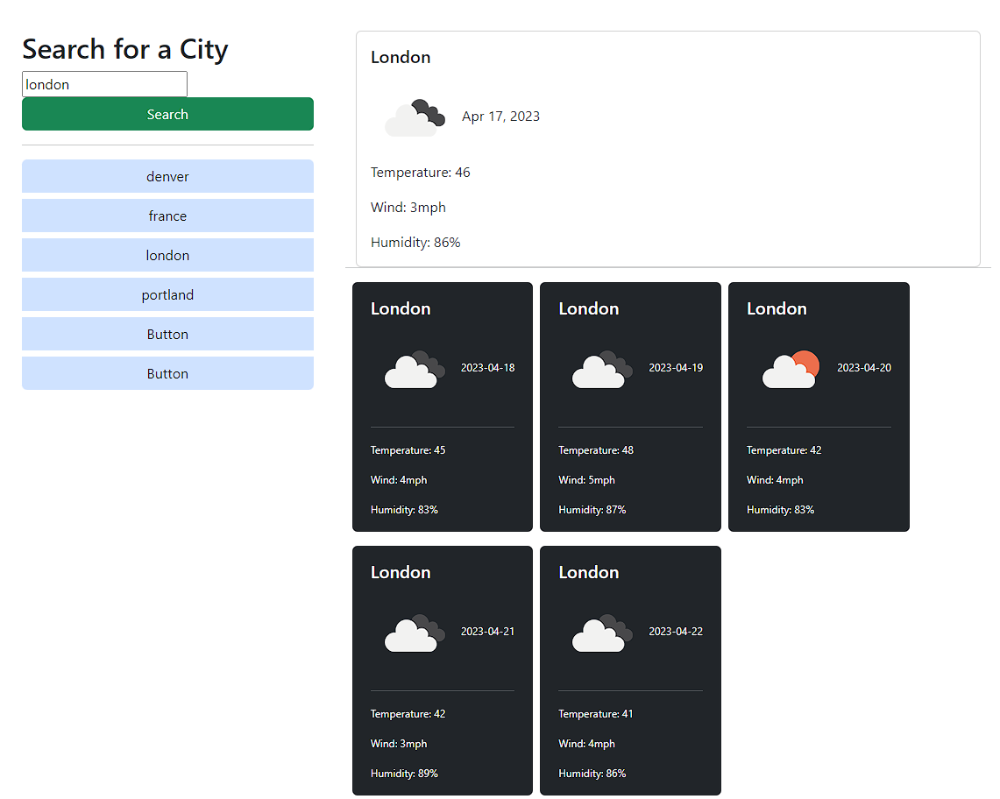

# Weather Dashboard

Welcome to the weather dashboard, your window to accessing the current and forecast weather around the world! Please review the following README for pertinent information regarding the webpage, and most importantly, enjoy!

## Description

This webpage has search functionality and storage features that allow multiple city or country queries to be made without having to refresh the webpage. The weather information that is returned is made possible by a third-party web api known as https://openweathermap.org.

## Usage

A search can be initiated by typing the name of a city or country into the 'Search' input and clicking the associated button directly below it. This invokes the two major functions on the webpage.

First, the page will reach out to the third party weather api to obtain the specific current and forecast data, then display to the page within the card section a list of key weather-related data items; these include the city name, date, temperature, wind speed, humidity and a visual icon displaying the overall "state" of the current and forecast weather.

Second, the page will store each search in local storage and list each previous city/country search that can be recalled by clicking on the associated button within the vertical button group directly below the main search button. This will re-populate the page with that particular location's updated current and forecast weather conditions.

## Links

GitHub: https://github.com/buster35/wakasa-sinus

GitHub Pages: 

## Screenshot

## License

Please refer to the license file.